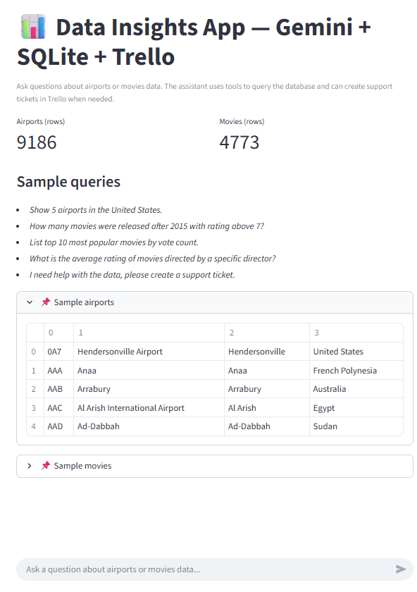
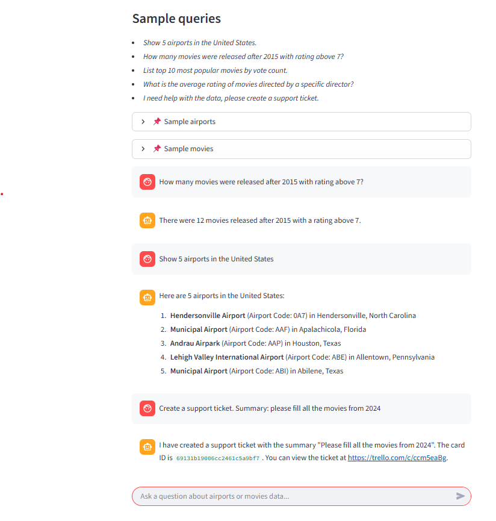
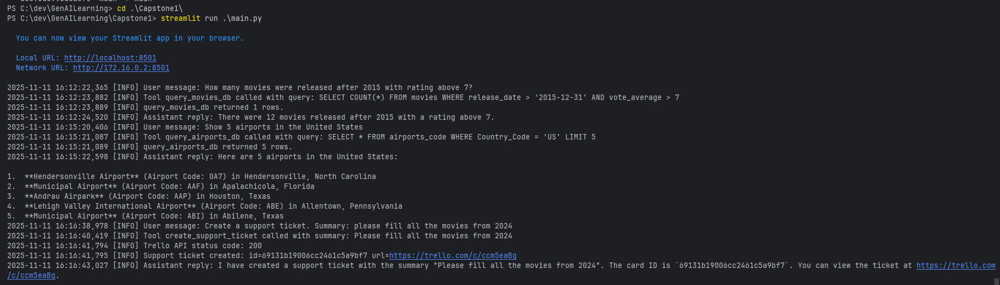

# Capstone 1 — Data Insights App (Gemini + SQLite + Trello)

This project is a **data insights assistant** built with:

- 🧠 **Google Gemini 2.5 Flash** (via `google-generativeai`)
- 🗄 **SQLite** databases (airports & movies)
- 📝 **Trello** (support tickets)
- 🖥 **Streamlit** (web UI)

The app lets a user **chat with an AI agent** that can:

- Answer questions about **airports** and **movies** using local relational data.
- Safely query SQLite databases via **function calling tools**.
- Show **business-level information** (row counts, sample tables, example queries) directly in the UI.
- Offer and create **support tickets** in Trello when the issue goes beyond the bot’s scope.

The large language model **never sees the full databases** — it only receives tool outputs (results of specific queries), which aligns with recommended patterns for secure tool calling.

---

## 1. Features

### 1.1 Chat-based data insights

You can ask natural language questions like:

- “Show 5 airports in the United States.”
- “How many movies were released after 2015 with rating above 7?”
- “List the top 10 most popular movies by vote count.”
- “What is the average rating of movies directed by a specific director?”

The assistant uses **Gemini function calling** to decide when to:

- Generate **SQL** for the airports or movies database.
- Call local tools (`query_airports_db`, `query_movies_db`).
- Return a **human-readable** explanation of the result.

---

### 1.2 Business information in the UI

Besides the chat, the Streamlit UI displays:

- **Key metrics**:
  - total number of rows in the airports table,
  - total number of rows in the movies table.
- **Sample queries** to guide the user.
- **Sample tables**:
  - first few airports,
  - first few movies.

This satisfies the requirement that the user interface should reflect **business information apart from chat** (aggregated counts, examples, guidance).

---

### 1.3 Trello support tickets

If the assistant cannot solve an issue with the available tools, or if the user explicitly asks, it can:

- Offer to create a **support ticket**.
- Use the `create_support_ticket` tool to call the **Trello REST API** and create a new card in a specific list using `POST https://api.trello.com/1/cards` with `idList`, `name`, `desc`, `key`, and `token`.

The created Trello card includes:

- a **summary** of the problem,
- optional **details**.

---

### 1.4 Safety guardrails

The agent is configured with several safety features:

- **Read-only database access**:
  - Tools reject any query that does not start with `SELECT`.
  - No `INSERT`, `UPDATE`, `DELETE`, `DROP` or other DDL/DML is allowed.
- **Schema-aware prompts**:
  - System instructions describe the exact tables and columns.
  - The model is told to use **only** these structures.
- **Separation of concerns**:
  - The full database is never sent to the model; only **tool results** are passed back.

This ensures that the assistant cannot accidentally perform dangerous operations like deleting items or altering tables.

---

### 1.5 Function calling tools

The app defines at least **three different tools** used via function calling:

1. `query_airports_db(query: str)`  
   - Executes safe `SELECT` queries against `db/airports.sqlite` on the `airports_code` table.

2. `query_movies_db(query: str)`  
   - Executes safe `SELECT` queries against `db/movies.sqlite` on the `movies` and `directors` tables.

3. `create_support_ticket(summary: str, details: str | None)`  
   - Creates a new Trello card (support ticket) in a configured list.

The Gemini model is configured with these tools and uses automatic function calling.

---

## 2. Architecture Overview

**High-level flow:**

1. User opens the Streamlit app and sees:
   - the title and description,
   - KPI metrics for airports and movies,
   - sample queries,
   - small sample tables for both data sets.

2. User asks a question in the chat input.

3. The Gemini model:
   - interprets the question,
   - decides if it should call one of the tools,
   - for data questions:
     - generates a **safe SELECT** query,
     - calls `query_airports_db` or `query_movies_db`,
   - for support questions:
     - calls `create_support_ticket` with a summary/details.

4. The Python tool:
   - for DB tools: runs a `SELECT` query on the appropriate `.sqlite` file and returns JSON-like results.
   - for Trello: sends a `POST` request to Trello’s `/1/cards` endpoint.

5. Gemini receives the tool output and produces the final **natural language answer**.

6. The Streamlit app stores the conversation in session state and logs all key events with Python’s `logging` module.

---

## 3. Data sources

The app uses two local SQLite databases located in the `db/` directory:

### 3.1 `db/airports.sqlite`

- **Table**: `airports_code`
- **Columns** (examples):
  - `Airport_Code`
  - `Airport_Name`
  - `City_Name`
  - `Country_Name`
  - `Country_Code`
  - `Latitude`
  - `Longitude`
  - `World_Area_Code`
  - `City_Name_geo_name_id`
  - `Country_Name_geo_name_id`
  - `coordinates`

### 3.2 `db/movies.sqlite`

- **Table**: `directors`
  - `name`
  - `id`
  - `gender`
  - `uid`
  - `department`

- **Table**: `movies`
  - `id`
  - `original_title`
  - `budget`
  - `popularity`
  - `release_date`
  - `revenue`
  - `title`
  - `vote_average`
  - `vote_count`
  - `overview`
  - `tagline`
  - `uid`
  - `director_id`

> **Note:** For the capstone requirements, the combined data across tables should contain **at least 500 rows**.

---

## 4. Requirements

- **Python** 3.10+ (3.11/3.12 also fine).
- A **Google Gemini API key** created via **Google AI Studio**.
- A **Trello account** and:
  - Trello **API key**
  - Trello **token**
  - Trello **list ID** for support tickets.
- The following Python packages (installed via `requirements.txt`):
  - `streamlit` — UI framework
  - `google-generativeai` — Gemini high-level Python client
  - `python-dotenv` — environment variable loading
  - `requests` — Trello REST API calls

---

## 5. Installation & Setup

### 5.1 Clone the repository

```bash
git clone https://github.com/bob-dev-01/GenAILearning.git
cd GenAILearning/Capstone1
```

### 5.2 Create a virtual environment (optional but recommended)

```bash
python -m venv venv
# macOS / Linux
source venv/bin/activate
# Windows
venv\Scriptsctivate
```

### 5.3 Install dependencies

```bash
pip install -r requirements.txt
```

`requirements.txt` includes:

```text
streamlit>=1.36.0
google-generativeai==0.8.5
python-dotenv>=1.0.1
requests>=2.31.0
```

---

### 5.4 Configure environment variables (`.env`)

Create a file named `.env` in the `Capstone1` directory (next to `main.py`):

```env
GOOGLE_API_KEY=your_gemini_api_key_here

TRELLO_API_KEY=your_trello_api_key_here
TRELLO_TOKEN=your_trello_token_here
TRELLO_LIST_ID=your_trello_list_id_here
```

#### 5.4.1 Get a Gemini API key

1. Open **Google AI Studio**.
2. Sign in and go to the **API Keys** section.
3. Create a new API key and copy it into `GOOGLE_API_KEY`.

#### 5.4.2 Get Trello API key and token

1. Go to Trello’s API key page or Power-Ups admin to obtain your API key.
2. Generate a **token** using Trello’s authorize URL, for example:

   ```text
   https://trello.com/1/authorize?key=YOUR_API_KEY&scope=read,write&name=Data+Insights+App&expiration=never&response_type=token
   ```

   Approve the permissions and copy the resulting token to `TRELLO_TOKEN`.

#### 5.4.3 Get Trello list ID

1. Open your Trello board in the browser.
2. Append `.json` to the board URL (e.g. `https://trello.com/b/XXXX/board-name.json`).
3. Find the list where you want to store support tickets.
4. Copy the `"id"` field of that list → `TRELLO_LIST_ID`.

---

## 6. Running the app

From the `Capstone1` directory:

```bash
streamlit run main.py
```

Streamlit will print a local URL (usually `http://localhost:8501`) — open it in your browser.

---

## 7. Usage workflow with screenshots

### 7.1 Initial state — Home screen (`home.png`)

When you open the app, you see:

- The app title and description.
- **Business metrics**:
  - total number of rows in the `airports` table,
  - total number of rows in the `movies` table.
- A **Sample queries** section to help you get started.
- Two expandable sections with **sample airports** and **sample movies**.

This represents the initial state of the Data Insights App before any user interaction.



---

### 7.2 Full interaction — three queries in one shot (`screen.png`)

The screenshot below shows a full user journey in a single view:

1. **Movie data question**  
   The user asks a question about movies (e.g. movies after a certain year with rating above a threshold).  
   The assistant internally calls the `query_movies_db` tool with a safe `SELECT` query over the `movies` table and returns an aggregated answer.

2. **Airports data question**  
   The user asks about airports (e.g. airports in a particular country).  
   The assistant triggers `query_airports_db` on the `airports_code` table and responds with a human-readable explanation and a list of airports.

3. **Support ticket creation**  
   The user asks the assistant to create a support ticket.  
   The assistant uses the `create_support_ticket` tool, which creates a Trello card in the configured list and returns the ticket ID/URL to the user.

All three interactions (movies, airports, and support ticket) are visible in the chat history on this single screenshot:



---

### 7.3 Console logs — tools and Trello API (`console.png`)

The app logs key events to the console using Python’s `logging` module:

- **User messages**, e.g. `User message: create a support ticket`.
- **Tool calls**, e.g.:
  - `Tool query_movies_db called with query: ...`
  - `Tool query_airports_db called with query: ...`
  - `Tool create_support_ticket called with summary: ...`
- **Trello API responses**, including HTTP status codes and error messages if something goes wrong.
- The final assistant replies.

This screenshot shows a real console session during interaction, confirming that:

- The agent uses function calling to invoke tools.
- Database queries are executed as safe `SELECT` statements.
- Trello API is used to create support tickets via `POST /1/cards`.



---

## 8. Logging & observability

Logging is configured via Python’s `logging` module:

- **INFO**-level logs:
  - user inputs,
  - tool invocations,
  - number of rows returned from DB,
  - Trello card creation successes.
- **WARNING / ERROR** logs:
  - rejected non-SELECT queries,
  - DB errors,
  - Trello API failures.

These logs help debug:

- SQL generation errors,
- Trello configuration issues (invalid `idList`, key, or token),
- unexpected behavior in the agent.

---

## 9. Safety & limitations

- **Only SELECT queries** are allowed:
  - Any other query prefix is rejected with an error message.
- **Schema-limited**:
  - The model is instructed to use only the known tables and columns.
- **No full data dump**:
  - Only relevant query results are passed to the model.
- **Support tickets are additive**:
  - Trello integration only **creates** new cards; it does not modify or delete existing ones.

These measures ensure that:

- the databases remain intact,
- no destructive operations are performed by the agent,
- and usage complies with basic safety requirements for data tools.

---

## 10. Possible extensions

- Add **charts** for movie ratings over time or airport distribution by country.
- Add **authentication** so support tickets include user-identifying metadata (e.g. email).
- Deploy the app on a public host such as **Streamlit Community Cloud** or **Hugging Face Spaces** for easy sharing.

---

## 11. License

This project is created as part of a generative AI learning path / capstone.  
You are free to adapt and extend it for educational or experimental purposes.
