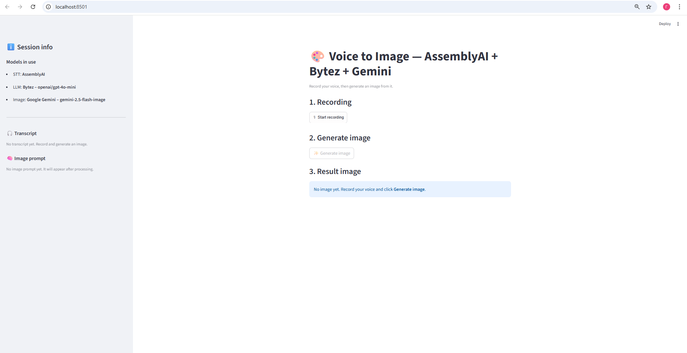
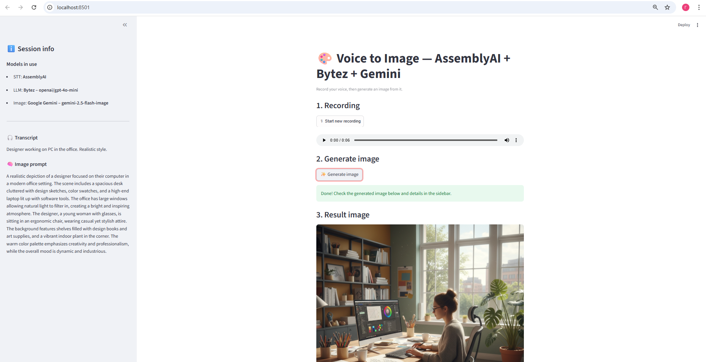
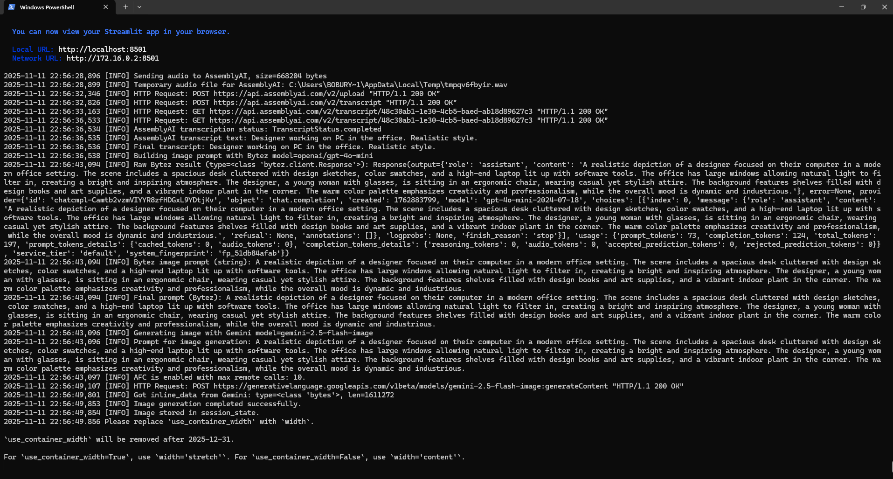

# Voice to Image App (AssemblyAI + Bytez + Gemini)

This project is a **Voice → Text → Image** application built with **Python** and **Streamlit**.

You speak a short description into your microphone, and the app:

1. Records your voice in the browser.
2. Sends the audio to **AssemblyAI** for speech-to-text transcription.
3. Sends the transcription to **Bytez** (GPT-4o-mini) to build a rich image-generation prompt.
4. Sends the generated prompt to **Google Gemini** (`gemini-2.5-flash-image`, a.k.a. Nano Banana) to generate an image.
5. Displays the resulting image, while showing all intermediate data (transcript + prompt) in the sidebar.
6. Logs every important step to the console for debugging and observability.

---

## Architecture Overview

Data flow:

```text
Microphone (audio)
    ↓
AssemblyAI (STT: speech-to-text)
    ↓
Bytez (LLM: GPT-4o-mini → detailed image prompt)
    ↓
Gemini 2.5 Flash Image (Nano Banana → image)
    ↓
Streamlit UI (shows only main actions in center, details in sidebar)
```

**Key components:**

- **Audio recording**: [`streamlit-mic-recorder`](https://pypi.org/project/streamlit-mic-recorder/)
- **Transcription (STT)**: [`assemblyai`](https://www.assemblyai.com/) Python SDK
- **Prompt generation (LLM)**: [`bytez`](https://bytez.com) SDK with `openai/gpt-4o-mini`
- **Image generation**: `google-genai` / `google.genai` client for `gemini-2.5-flash-image`
- **Frontend**: Streamlit

---

## Project Structure

```text
.
├── main.py             # Streamlit app with full voice → text → prompt → image pipeline
├── requirements.txt    # Python dependencies
├── README.md           # This file
└── screenshots/
    ├── 01_home.png         # App just launched (no audio yet)
    ├── 02_generated.png    # App after generating an image
    └── 03_console.png      # Console logs from one full run
```

You should place your screenshots into the `screenshots/` folder with these filenames (or adjust the paths in this README accordingly).

---

## Requirements

- Python 3.10+ (recommended)
- A modern browser
- The following API keys:
  - `ASSEMBLYAI_API_KEY` – for AssemblyAI STT
  - `BYTEZ_API_KEY` – for Bytez (GPT-4o-mini + platform)
  - `GOOGLE_API_KEY` or `google_api_key` – for Google Gemini

### Python dependencies

Example `requirements.txt`:

```txt
streamlit
python-dotenv
streamlit-mic-recorder
assemblyai
Pillow
bytez
google-genai
```

Install dependencies:

```bash
pip install -r requirements.txt
```

---

## Environment Configuration

Create a `.env` file in the project root with your keys:

```env
ASSEMBLYAI_API_KEY=your_assemblyai_key_here
BYTEZ_API_KEY=your_bytez_key_here
GOOGLE_API_KEY=your_google_gemini_key_here
```

Alternatively, you can use `google_api_key` instead of `GOOGLE_API_KEY`:

```env
google_api_key=your_google_gemini_key_here
```

The app will look for both `google_api_key` and `GOOGLE_API_KEY` and use whichever is set.

---

## How to Run Locally

From the project root:

```bash
streamlit run main.py
```

This will start a local Streamlit server, usually at:

- `http://localhost:8501`

Open this URL in your browser.

---

## Usage Walkthrough (Step by Step)

### 1. Initial screen (no audio yet)

When you first open the app, you will see:

- In the **center**:
  - Title: “Voice to Image — AssemblyAI + Bytez + Gemini”
  - Section **1. Recording** with a button `🎙 Start recording`
  - Section **2. Generate image** with a button `✨ Generate image` (disabled until you record)
  - Section **3. Result image** with an info message “No image yet…”

- In the **sidebar**:
  - List of **models in use**:
    - STT: AssemblyAI
    - LLM: Bytez – openai/gpt-4o-mini
    - Image: Google Gemini – gemini-2.5-flash-image
  - Empty blocks for **Transcript** and **Image prompt**

Screenshot example: **`screenshots/01_home.png`**

```markdown

```

### 2. Record your voice

1. Click **“🎙 Start recording”** in section **1. Recording**.
2. Speak a short description, e.g.:
   > Designer working on PC in the office. Realistic style..

3. Click **“🛑 Stop recording”**.

The app will:

- Show an audio player with your recorded clip.
- Enable the **“✨ Generate image”** button.
- In the console, you’ll see logs about audio size and temporary file paths.

### 3. Generate the image

Click **“✨ Generate image”**.

Behind the scenes:

1. The app sends your audio to **AssemblyAI**:
   - Logs: `Sending audio to AssemblyAI...`
   - Logs: `AssemblyAI transcription status: TranscriptStatus.completed`
2. The app sends the transcription text to **Bytez (GPT-4o-mini)**:
   - Logs: raw `Bytez` response and the final image prompt string.
3. The app sends the prompt to **Gemini 2.5 Flash Image**:
   - Logs: `Generating image with Gemini model=gemini-2.5-flash-image`
   - Logs: `Image generation completed successfully.`

What you see:

- In the **center**:
  - Under **3. Result image** you see the final generated image with the caption:
    > Image generated by Gemini from your voice prompt

- In the **sidebar**:
  - Under **Transcript**: the text recognized from your audio (e.g. “Designer working on PC in the office. Realistic style.”)
  - Under **Image prompt**: the detailed prompt created by Bytez (GPT-4o-mini).

Screenshot example: **`screenshots/02_generated.png`**

```markdown

```

### 4. Console logs

In the terminal / console where you ran `streamlit run main.py`, you will see logs for the full pipeline, for example:

- Audio upload and transcription steps
- Final transcription text
- Raw Bytez response and final prompt
- Gemini image generation steps
- Errors, if any

This is useful both for debugging and for demonstrating that the app logs every important step.

Screenshot example: **`screenshots/03_console.png`**

```markdown

```

---

## Models Used

- **AssemblyAI** – speech-to-text transcription.
- **Bytez – openai/gpt-4o-mini** – converts user’s transcription into a detailed, structured image-generation prompt.
- **Google Gemini – gemini-2.5-flash-image** – generates the final image (Nano Banana image model).

You can swap or tune models by editing:

- `BYTEZ_MODEL_ID` for the LLM prompt model.
- `IMAGE_MODEL = "gemini-2.5-flash-image"` for the image model.

---

## Logging

The app uses Python’s `logging` module (level `INFO`) and prints:

- Audio size, temporary file location for AssemblyAI.
- Transcription status and final transcript.
- Raw Bytez response and final prompt string.
- Gemini request flow and success/failure.
- Any errors in the pipeline.

This satisfies the requirement that *the agent should print logs to the console*.

Example excerpt from logs (simplified):

```text
[INFO] Sending audio to AssemblyAI, size=812204 bytes
[INFO] AssemblyAI transcription status: TranscriptStatus.completed
[INFO] AssemblyAI transcript text: Designer working on PC in the office. Realistic style....
[INFO] Building image prompt with Bytez model=openai/gpt-4o-mini
[INFO] Bytez image prompt (string): A realistic depiction of a designer ...
[INFO] Generating image with Gemini model=gemini-2.5-flash-image
[INFO] Image generation completed successfully.
```

---

## Deploying to Hugging Face Spaces (Optional)

To deploy on [Hugging Face Spaces](https://huggingface.co/spaces):

1. Create a new Space of type **Streamlit**.
2. Upload:
   - `main.py`
   - `requirements.txt`
   - `README.md`
   - `screenshots/` (optional, for documentation)
3. In the Space **Settings → Secrets**, add:
   - `ASSEMBLYAI_API_KEY`
   - `BYTEZ_API_KEY`
   - `GOOGLE_API_KEY`
4. The Space will install dependencies from `requirements.txt` and run `streamlit run main.py` automatically.

This gives you a hosted web version of your Voice-to-Image app.

---

## Notes

- Make sure your audio clips are relatively short (a few seconds), to keep latency and costs reasonable.
- If you hit rate limits or `429` errors from any provider, consider adding a cooldown, retry logic, or using smaller models/shorter prompts.
- For production usage, you may want to add authentication and stricter error handling.

Enjoy turning your voice into images! 🎙️✨🖼️
