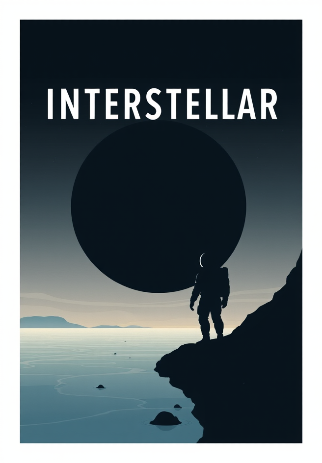
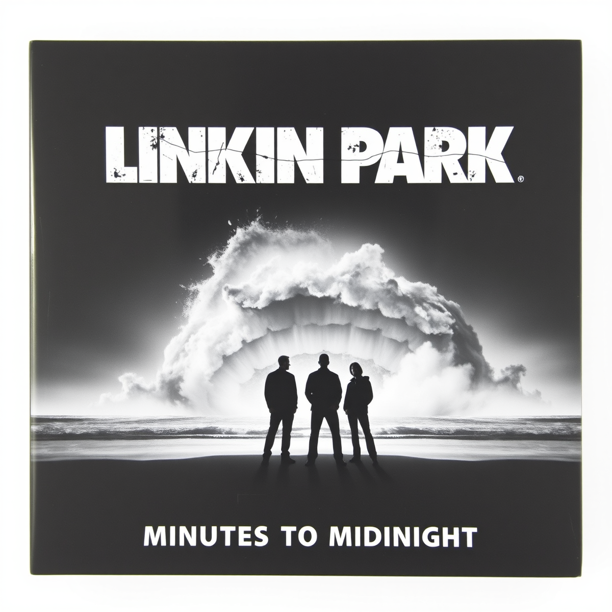
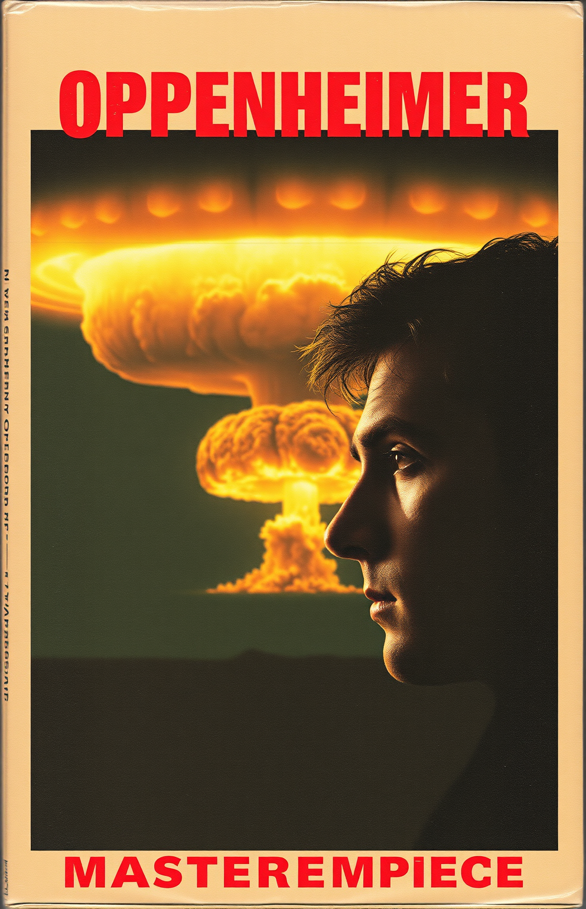

# Advanced Generative AI: Media Cover Redesign Task

## 1. Project Overview
**Objective:** Design alternative cover variations for iconic media pieces using self-hosted generative AI solutions.
**Tooling:** Self-hosted ComfyUI on Cloud GPU.

## 2. Infrastructure & Resources
*   **Hosting:** RunPod.io (GPU Cloud)
*   **Hardware:** NVIDIA RTX 3090 (24GB VRAM) / RTX 4090
*   **Software:** ComfyUI (Self-hosted instance)
*   **Model Used:** [FLUX.1 [schnell] (fp8 version)](https://huggingface.co/black-forest-labs/FLUX.1-schnell)
*   **Workflow Type:** Image-to-Image (Img2Img) with custom workflows.

---

## 3. Generated Variations

### Variation A: Book Cover
**Subject:** *Interstellar* (Sci-Fi Novelization)
**Concept:** Transforming a movie poster into a minimalist vector art book cover.

| Original Work | AI-Generated Variation |
| :---: | :---: |
|  |  |

**Generation Details:**
*   **Workflow:** Basic Img2Img with Flux Schnell.
*   **Steps:** 4
*   **Sampler:** Euler / Simple
*   **CFG Scale:** 1.0
*   **Denoise Strength:** 1
*   **Resolution:** 896x1152

**Prompt:**
> **Positive:** book cover for sci-fi novel "Interstellar", vector art style, minimalist, silhouette of astronaut, giant wave, text "INTERSTELLAR" in white font
> **Negative:** photo, realistic, 3d render

---

### Variation B: Audio Album (CD)
**Subject:** Linkin Park - *Minutes to Midnight*
**Concept:** Alternative monochromatic cover design focusing on atmosphere and texture.

| Original Work | AI-Generated Variation |
| :---: | :---: |
|  |  |

**Generation Details:**
*   **Workflow:** Img2Img with Flux Schnell.
*   **Steps:** 4
*   **Sampler:** Euler / Simple
*   **CFG Scale:** 1.0
*   **Denoise Strength:** 0.95

**Prompt:**
> **Positive:** DVD music album cover for Linkin Park "Minutes to Midnight". Gritty black and white photography, high contrast. Silhouettes of band members standing on a beach facing a giant storm at sea. The text "LINKIN PARK" is written in distressed white stencil font at the top. The title "MINUTES TO MIDNIGHT" at the bottom. Cinematic grain, raw emotion, Rick Rubin production style, masterpiece.
> **Negative:** color, colorful, bright, rainbow, cartoon, anime, drawing, sketch, vector art, low quality, blurry text, watermark

---

### Variation C: VHS Video Cassette
**Subject:** *Oppenheimer* (Movie)
**Concept:** Retro 90s thriller VHS aesthetic with paper texture and analog noise.

| Original Work | AI-Generated Variation |
| :---: | :---: |
|  |  |

**Generation Details:**
*   **Workflow:** Img2Img + Image Resize Node (to fit VHS aspect ratio).
*   **Steps:** 4
*   **Sampler:** Euler / Simple
*   **CFG Scale:** 1.0
*   **Denoise Strength:** 0.90
*   **Output Resolution:** 992x1536 (VHS ratio)

**Prompt:**
> **Positive:** VHS cassette cover for movie "Oppenheimer". Vintage 90s style, faded paper texture, worn edges, analog video noise. Close up of Cillian Murphy looking at a giant nuclear explosion mushroom cloud. Retro typography, color bleed. The text "OPPENHEIMER" in red distressed font at the top. Masterpiece, grainy.
> **Negative:** dvd, blu-ray, modern, 4k, digital, clean, sharp, 3d render

---

## 4. Workflows & Configuration

### Pipeline Screenshots
Below are the screenshots of the ComfyUI node graphs used for generation.

**Book Workflow:**

**CD/Audio Workflow:**

**VHS Workflow (with Resize Node):**

### JSON Workflows
You can load these JSON files directly into ComfyUI to reproduce the results:
*   [Book Workflow JSON](json-pipelines/book.json)
*   [CD Workflow JSON](json-pipelines/CD.json)
*   [VHS Workflow JSON](json-pipelines/VHS.json)